# Temporal Conflict Resolution in Multi-Source Financial Transaction Records

[](https://github.com/<you>/temporal-conflict-resolution/actions/workflows/ci.yml)
[](LICENSE)

A deterministic reconciliation engine that ingests transaction records from
multiple sources, resolves conflicts using a priority-based business rule
chain, and maintains an accurate, versioned, fully auditable state of every
record. Built for the "Temporal Conflict Resolution in Multi-Source Financial
Transaction Records" hackathon problem statement (see `prd.md`).

Every push and PR runs the full suite in CI (setup check, 17 unit tests,
1200-event benchmark, all 6 demo scenarios, CLI against every sample input,
and a full notebook execution) across Python 3.9–3.12 — see
`.github/workflows/ci.yml`.

Core engine is **pure Python standard library** (`sqlite3`, `dataclasses`,
`argparse`) — nothing to install to run it.

### See it run



*(An actual recorded terminal session of `python demo.py` — not a
screenshot. If it doesn't render in your viewer, run `python demo.py`
yourself, it takes about a second.)*

---

## Quick Start

### Prerequisites

- Python 3.9+
- No external packages needed for the core engine (stdlib only)
- Optional: `jupyter pandas matplotlib` for the visualization notebook
- Optional: `cx_Oracle` for the bonus Oracle DB persistence path

### Clone & Run

```bash
git clone https://github.com/<you>/temporal-conflict-resolution.git
cd temporal-conflict-resolution

# sanity-check that everything is in place
python setup.py

# Run the interactive demo — walks through all 6 core edge cases
python demo.py

# Run the engine on a sample file
python main.py --input sample_inputs/comprehensive_all_cases.json

# Run with verbose per-event JSON output
python main.py --input sample_inputs/2_conflicting_amounts.json --verbose

# Generate a full JSON audit report
python main.py --input sample_inputs/3_late_events.json \
    --output audit_output/report.json --report

# Read events from stdin instead of a file
cat sample_inputs/1_duplicate_events.json | python main.py

# Run the full automated test suite (17 tests)
python main.py --test

# Performance benchmark (1200 events, must finish under 5s)
python main.py --benchmark

# (optional) install visualization deps and open the notebook
pip install -r requirements.txt
jupyter notebook notebooks/visualization.ipynb

# (bonus) run the real-time HTTP endpoint
python http_server.py --port 8080
curl -X POST localhost:8080/events -d '{"transaction_id":"TXN-1","source":"PrimaryBank","amount":100,"currency":"USD","status":"Pending"}'
curl localhost:8080/transactions

# Or use Make
make demo
make test
make benchmark
make report
make notebook
```

---

## Repository Structure

```
.
├── main.py                    # entry point: --input / --test / --benchmark
├── demo.py                    # interactive walkthrough of 6 edge cases
├── setup.py                   # sanity-checks that all files/imports are present
├── schema.sql                 # SQLite schema (5 tables, see below)
├── requirements.txt           # optional viz/Oracle deps (core engine needs none)
├── Makefile
├── prd.md                     # original problem statement
├── src/
│   ├── models.py                # TransactionEvent, TransactionState, ReconciliationResult
│   ├── database.py              # SQLite persistence layer
│   ├── reconciliation_engine.py # conflict detection + resolution + audit logic
│   └── cli.py                   # argparse-based CLI
├── tests/
│   └── test_engine.py          # 17 tests covering every PRD edge case
├── sample_inputs/
│   ├── 1_duplicate_events.json
│   ├── 2_conflicting_amounts.json
│   ├── 3_late_events.json
│   ├── 4_missing_fields.json
│   ├── 5_invalid_status_transition.json
│   ├── 6_midnight_boundary.json
│   └── comprehensive_all_cases.json   # all of the above, combined
├── audit_output/                # --report writes JSON reports here
├── notebooks/
│   └── visualization.ipynb      # charts + audit-trail drill-down (pandas/matplotlib)
├── http_server.py                # bonus: real-time HTTP endpoint (stdlib only)
├── ARCHITECTURE.md               # data-flow diagram + design decisions, for judges
└── db/                           # bonus: Oracle DB persistence path
    ├── oracle_schema.sql
    └── oracle_connect.py
```

See `ARCHITECTURE.md` for the full decision-flow diagram and the reasoning
behind each design choice.

---

## How Conflict Resolution Works

When a new event arrives for a `transaction_id` that already has state, the
engine compares `amount`, `currency`, and `status`. Any field that differs is
a **conflict**. Conflicts are resolved with this priority chain, straight
from the PRD:

1. **Source priority** — `PrimaryBank` beats every other source.
2. **Confidence score** — if source priority ties, higher `confidence_score` wins.
3. **Timestamp** — if that ties too, the later timestamp wins.
4. **Event sequence** — if timestamps land in the same second, the earlier
   `event_sequence` wins.

`status` gets one more check on top of this: a proposed status change is only
applied if it's a legal transition (`Pending → Approved → Completed`, with
`Rejected` reachable from `Pending` or `Approved`; `Completed`/`Rejected` are
terminal). An illegal jump — e.g. `Pending → Completed` directly — is
rejected and flagged as a warning, even if the event that proposed it would
otherwise have won the field-level conflict.

Every event is content-hashed (`transaction_id` + `source` + `timestamp` +
all field values) before processing, so exact duplicates are detected and
ignored — this is what makes processing **idempotent**. Batches are sorted by
timestamp before processing (per the PRD), but because resolution is driven
by the priority chain above rather than arrival order, **out-of-order or
"late" events still resolve deterministically** to the same final state no
matter what order they're fed in — see
`tests/test_engine.py::TestDeterminismAndReplay`.

Every accepted state change is versioned (`version_history`), every conflict
and its resolution is logged (`conflict_log`), and a running narrative of
every decision is kept (`audit_trail`) — that's what
`main.py --input ... --report` and the notebook's audit drill-down surface.

---

## Database Schema

Five tables (`schema.sql`):

- **`transaction_state`** — one row per transaction: current authoritative state.
- **`event_log`** — every event ever received, keyed by a content hash (idempotency).
- **`conflict_log`** — every field-level conflict and how it was resolved.
- **`version_history`** — append-only history of every accepted state change.
- **`audit_trail`** — human-readable narrative of every decision made.

`db/oracle_schema.sql` is a straight dialect translation of the same five
tables for teams that want to persist to Oracle instead (bonus scope) —
apply it with `python db/oracle_connect.py --dsn ... --user ... --password ...`
(requires `pip install cx_Oracle`).

---

## Testing

```bash
python main.py --test
```

17 tests across duplicates, conflicting amount/currency/status, late/out-of-
order events, status-regression protection, missing timestamp/source,
invalid status transitions, midnight-boundary ordering, replay determinism,
and a 1000-event performance run (must complete in <5s; typically runs in
well under a second).
